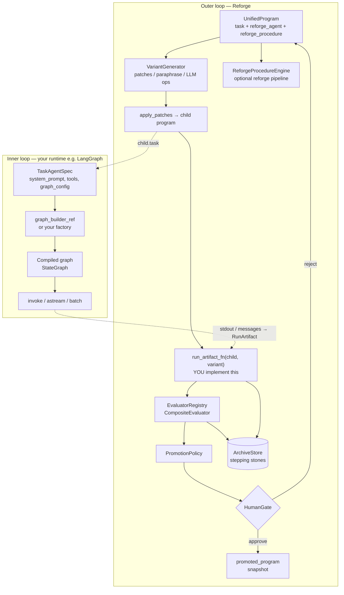
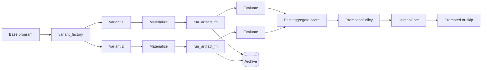
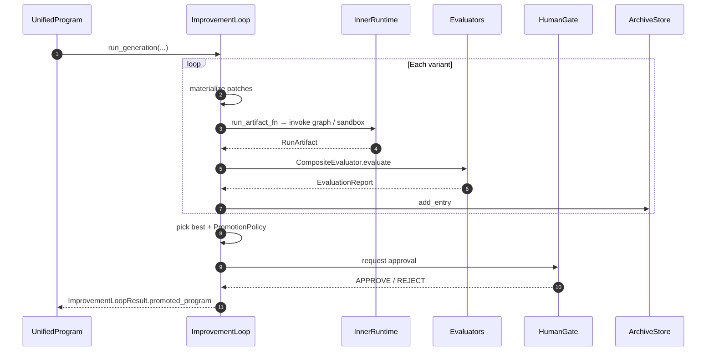
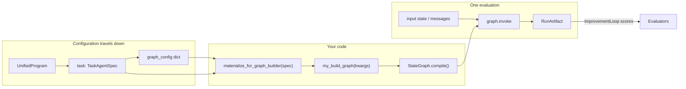

# Layerd AI Agent Reforge

**Layerd AI Agent Reforge** is a Python library for the **outer loop** of agent development: generating program variants, running them under constraints, scoring them with evaluators, archiving results, optionally **gating promotion on human approval**, and evolving an **editable reforge procedure** (the improvement pipeline itself can change). It is meant to sit **next to** runtimes like **[LangGraph](https://github.com/langchain-ai/langgraph)**—your graph still executes tasks; **Reforge** versions and improves the **unified program** (prompts, tools, graph hints, evaluator wiring) that you compile into that runtime.

**Spelling:** the product short name is **Reforge** (with a final *e*). The PyPI package remains **`layai-agent-reforge`**; the import path is **`layai_reforge`**.

Research concepts are **inspired by** Meta’s **HyperAgents** / DGM-H ([HyperAgents publication](https://ai.meta.com/research/publications/hyperagents/)). This project is **not affiliated with or endorsed by Meta**.

---

## Table of contents

- [Architecture & diagrams](#architecture--diagrams)
- [LangGraph integration](#langgraph-integration)
- [What this package is (and is not)](#what-this-package-is-and-is-not)
- [Core concepts](#core-concepts)
- [How the improvement loop works](#how-the-improvement-loop-works)
- [Installation](#installation)
- [How to use it](#how-to-use-it)
- [Program patches](#program-patches)
- [Sandboxing](#sandboxing)
- [Evaluators](#evaluators)
- [Human approval](#human-approval)
- [Reforge procedure engine](#reforge-procedure-engine)
- [CLI (`layai-reforge`)](#cli-layai-reforge)
- [Examples](#examples)
- [Documentation](#documentation)
- [Developing & testing](#developing--testing)
- [License](#license)

---

## Architecture & diagrams

**Layerd AI Agent Reforge** is the **outer loop**: it versions and scores **whole-program** snapshots (`UnifiedProgram`). **LangGraph** (or any runtime) is the **inner loop**: it executes a single task invocation given a compiled graph and state. Reforge never replaces LangGraph; it **feeds** it configuration (prompts, tools, `graph_config`) and **consumes** evidence of quality (`RunArtifact`) from runs you define.

The diagrams below render on **GitHub** as interactive Mermaid. For a **PNG** (slides, Confluence, decks), paste the fenced diagram into [Mermaid Live Editor](https://mermaid.live) and export, or use a local Mermaid → PNG tool.

### End-to-end system view



### Improvement loop (detail)



### Promotion sequence (conceptual)



---

## LangGraph integration

Reforge does **not** compile or run LangGraph for you in the core loop. You connect the two by:

1. **Storing** graph-oriented settings on **`TaskAgentSpec`**: `system_prompt`, `tools`, **`graph_config`** (arbitrary JSON for your builder), optional **`graph_builder_ref`** (import path to your factory).
2. **Materializing** those fields into kwargs your builder expects via **`materialize_for_graph_builder`** / **`build_with_callable`** in `layai_reforge.adapters.materializer`.
3. **Implementing** **`run_artifact_fn`** so it builds or loads the graph, runs **`graph.invoke(...)`** (or async equivalent), then returns a **`RunArtifact`** your evaluators can score.
4. **Optional:** map LangGraph outputs to artifacts with **`run_artifact_from_langgraph_result`** or **`wrap_invoke`** in `layai_reforge.adapters.langgraph` (requires **`pip install layai-agent-reforge[langgraph]`**).

### Reforge ↔ LangGraph (data flow)



### Minimal integration sketch

```python
# pip install "layai-agent-reforge[langgraph]"
from layai_reforge.adapters.langgraph import run_artifact_from_langgraph_result
from layai_reforge.adapters.materializer import materialize_for_graph_builder
def run_artifact_fn(child_program, variant):
    spec = child_program.task
    kwargs = materialize_for_graph_builder(spec)  # prompt, tools, graph_config, …
    graph = build_my_langgraph(**kwargs)  # your factory using spec.graph_config
    result = graph.invoke({"messages": [("user", "…")]})
    return run_artifact_from_langgraph_result(
        result,
        variant_id=variant.id,
        program_fingerprint=child_program.content_fingerprint(),
    )
```

Wire that `run_artifact_fn` into **`ImprovementLoop.run_generation`** as shown in [How to use it](#how-to-use-it). Evaluators can inspect **`RunArtifact.stdout`**, **`messages`**, or **`extra`** depending on what you fill in.

### Division of responsibility

| Concern | **LangGraph** | **Reforge** |
|--------|----------------|-------------|
| Nodes, edges, state schema, `invoke` / streaming | Yes | No |
| Variant generation, patches, archive | No | Yes |
| Scoring runs, promotion policy, human gate | No | Yes |
| Persisting **which** prompts/tools/config won the outer loop | Indirectly via your deploy of `promoted_program` | Yes (`UnifiedProgram` snapshot) |

---

## What this package is (and is not)

| Reforge **is** | Reforge **is not** |
|----------------|-------------------|
| A framework for **variants → runs → evaluation → archive → optional promotion** | A replacement for LangGraph, AutoGen, or your chat UI |
| A place to define **`UnifiedProgram`** (task + reforge agent + reforge procedure) as data | An LLM hosting service |
| **Sandbox** helpers (`SandboxRunner`) for subprocess-style runs with defaults like **no network** | A full MLOps or deployment platform |
| **HumanGate** hooks before treating a variant as canonical | A built-in web dashboard (you can add one on top of the API) |

Promotion produces an in-memory **`UnifiedProgram` snapshot** (`ImprovementLoopResult.promoted_program`). **Deploying** that snapshot to production is **your** application’s responsibility.

---

## Core concepts

- **`UnifiedProgram`** — One structured artifact: **`TaskAgentSpec`** (system prompt, tools, graph builder ref, `graph_config`, limits), **`ReforgeAgentSpec`** (prompts for the **reforge agent** that proposes program patches), and **`ReforgeProcedureSpec`** (declarative pipeline steps + **`evaluator_ids`** used by the improvement loop when scoring runs).
- **`Variant`** — A set of **`ProgramPatchOp`** entries applied to a parent program to form a child candidate.
- **`VariantGenerator`** — Builds variants (e.g. paraphrase prompt, tool subsets, LLM-proposed patches if you supply an `llm_fn`).
- **`ImprovementLoop`** — **`run_generation`** drives: materialize variants → your **`run_artifact_fn`** produces **`RunArtifact`** → **evaluators** (via **`EvaluatorRegistry`**) → **`PromotionPolicy`** → optional **`HumanGate`** → optional **`promoted_program`**; every candidate is also **archived** via **`ArchiveStore`**.
- **`ArchiveStore`** — Persists **stepping-stone** programs and scores (e.g. **`SqliteArchiveStore`**; optional Postgres extra).
- **`ReforgeSession`** — Convenience wrapper: default sandbox, default **`MathGradingEvaluator`** registration, ledger/reforge-memory/audit wiring, and helpers like **`run_improvement_generation(loop, ...)`** and **`run_reforge_pipeline()`**.

---

## How the improvement loop works

At a high level:

1. You supply a **base** `UnifiedProgram` and a **variant factory** (list of `Variant`).
2. For each variant, the library **materializes** a child program (**`apply_patches`**), then calls your **`run_artifact_fn(child, variant)`** to obtain a **`RunArtifact`** (stdout/stderr, exit code, optional `extra`).
3. Evaluators named in **`child.reforge_procedure.evaluator_ids`** are resolved and composed; an **aggregate** score is computed (**`CompositeEvaluator`**).
4. The best-scoring variant is a candidate for **promotion** if **`PromotionPolicy.should_promote`** passes (default: minimum aggregate score **0.8** and all sub-evaluators must **pass** when `require_all_evaluators_pass` is true).
5. If a **`HumanGate`** is configured, **`APPROVE`** is required before **`promoted_program`** is set; otherwise the gate can **auto-approve** (useful for tests).
6. Each variant’s run is recorded as an **`ArchiveEntry`** in the store.

See **[Architecture & diagrams](#architecture--diagrams)** for full Mermaid flows (system view, improvement detail, sequence, LangGraph data flow).

The **`ReforgeProcedureEngine`** is a **separate** path: it walks **`ReforgeProcedureSpec.steps`** (retrieve archive, propose patch, static lint, etc.) and is typically used for **outer-loop** edits and experimentation, not as a substitute for wiring **`ImprovementLoop`** for your task runs.

---

## Installation

```bash
pip install layai-agent-reforge
```

**Optional extras:**

| Extra | Purpose |
|-------|---------|
| `langgraph` | LangGraph adapters (`layai_reforge.adapters.langgraph`) |
| `postgres` | Postgres-backed archive |
| `dev` | `pytest`, `pytest-asyncio` for contributors |

```bash
pip install "layai-agent-reforge[langgraph,dev]"
```

---

## How to use it

### 1. Define a program and archive

```python
from pathlib import Path

from layai_reforge import SqliteArchiveStore, UnifiedProgram
from layai_reforge.models.program import ReforgeProcedureSpec, TaskAgentSpec

program = UnifiedProgram(
    task=TaskAgentSpec(system_prompt="You are a careful assistant."),
    reforge_procedure=ReforgeProcedureSpec(evaluator_ids=["math_grade"]),
)
archive = SqliteArchiveStore(Path(".reforge/archive.sqlite"))
```

### 2. Wire an improvement loop

You provide **`variant_factory(base) -> list[Variant]`** and **`run_artifact_fn(child, variant) -> RunArtifact`**. The artifact is what evaluators score (e.g. stdout for **`MathGradingEvaluator`**).

```python
from layai_reforge.evaluators.math_eval import MathGradingEvaluator
from layai_reforge.evaluators.registry import EvaluatorRegistry
from layai_reforge.loop.improvement import ImprovementLoop
from layai_reforge.loop.variants import VariantGenerator
from layai_reforge.models.artifacts import RunArtifact
from layai_reforge.sandbox.runner import SandboxConfig, SandboxRunner

sandbox = SandboxRunner(SandboxConfig(workspace_root=Path.cwd()))
registry = EvaluatorRegistry()
registry.register(MathGradingEvaluator(golden_answer="42"))

vg = VariantGenerator(seed=0)
variants = [vg.paraphrase_prompt_variant(program)]

def run_artifact_fn(child, variant):
    return RunArtifact(
        run_id="r1",
        variant_id=variant.id,
        stdout="42",
        success=True,
    )

loop = ImprovementLoop(archive=archive, sandbox=sandbox, registry=registry)
result = loop.run_generation(
    program,
    variant_factory=lambda p: variants,
    run_artifact_fn=run_artifact_fn,
)
# result.promoted_program may be None (policy / human gate / scores)
```

### 3. Optional: `ReforgeSession`

```python
from layai_reforge import ReforgeSession

session = ReforgeSession(program=program, archive=archive)
result = session.run_improvement_generation(loop, variant_factory=lambda p: variants, run_artifact_fn=run_artifact_fn)
```

Register any **custom evaluators** on **`session.registry`** (or build your own **`EvaluatorRegistry`** for **`ImprovementLoop`**) so IDs in **`reforge_procedure.evaluator_ids`** resolve.

---

## Program patches

Patches are validated **`ProgramPatchOp`** values applied by **`apply_patches`** (see `src/layai_reforge/patches.py`). Supported operations include:

| Operation | Role |
|-----------|------|
| `set_system_prompt` | Replace task system prompt |
| `add_tool` / `remove_tool` | Mutate **`ToolDescriptor`** list |
| `set_graph_config_key` | Set a key under **`task.graph_config`** (path-safe) |
| `set_reforge_patch_prompt` / `set_reforge_procedure_patch_prompt` | Reforge agent prompts |
| `replace_reforge_procedure_steps` | Replace **`ReforgeProcedureStep`** list |
| `set_reforge_procedure_evaluators` | Set evaluator IDs for scoring |

Unknown ops are rejected.

---

## Sandboxing

**`SandboxConfig`** defaults include a wall-clock timeout, **`allow_network=False`**, and an **`env_allowlist`** for subprocess environments. **`SandboxRunner.run_command`** executes under these constraints and returns **`RunArtifact`**-oriented results; see `src/layai_reforge/sandbox/runner.py` for backends (**subprocess** default; optional **Docker**).

---

## Evaluators

Built-in examples live under **`layai_reforge.evaluators`**: e.g. **`MathGradingEvaluator`**, coding/paper/robotics helpers. Register them by **`id`** so they match **`ReforgeProcedureSpec.evaluator_ids`**. **`CompositeEvaluator`** merges multiple evaluators and writes an **`aggregate`** metric (configurable key).

---

## Human approval

**`HumanGate`** can **`auto`-approve/reject** (tests, batch jobs) or take an async **`on_request(variant, report)`** callback for interactive UIs or ticket systems. Until approval, **`ImprovementLoopResult.promoted_program`** stays **`None`** when the gate rejects.

---

## Reforge procedure engine

**`ReforgeProcedureEngine.run(ctx)`** executes **`ReforgeProcedureSpec.steps`**: e.g. **`retrieve_archive`**, **`propose_patch`** (if you pass **`propose_patch_fn`**), **`static_lint`**, **`simulate_rollout`** (hook placeholder), **`aggregate_scores`**, **`rollback`**, **`summarize_reforge_memory`**. Use this to experiment with **how** the reforge side proposes changes; combine with **`ReforgeSession.run_reforge_pipeline`** for a single entrypoint.

**Schema:** saved programs use **`schema_version` `"2"`** with fields **`reforge_agent`** and **`reforge_procedure`**. Legacy files that used **`meta`** / **`meta_procedure`** (v1) are still accepted by **`load_program`** / **`UnifiedProgram.model_validate`** via a migration hook.

---

## CLI (`layai-reforge`)

```bash
layai-reforge --help
```

Useful commands:

| Command | Purpose |
|---------|---------|
| **`init <path>`** | Write a starter program JSON/YAML |
| **`archive-list --db …`** | List SQLite archive entries |
| **`export` / `import`** | Export or merge archive **bundle** JSON |
| **`eval-once <program>`** | Load program and print **fingerprint** JSON |

Subcommands like **`promote`**, **`run-loop`**, and **`replay`** currently print guidance: **promotion and the full outer loop are intended to be driven from Python** (`ImprovementLoop`, **`HumanGate`**, your telemetry).

---

## Examples

| Path | What it shows |
|------|----------------|
| **`examples/minimal_loop.py`** | Minimal variant → artifact → **`MathGradingEvaluator`** → archive |
| **`examples/cross_domain_transfer.py`** | Transfer / domain tagging patterns |
| **`examples/hypothetical_status_agent.py`** | End-to-end **stub** “health check” scenario (simulated stdout from prompt inspection); run with `python examples/hypothetical_status_agent.py` from the repo (or install the package) |

From a checkout:

```bash
pip install -e ".[dev]"
pytest
python examples/hypothetical_status_agent.py
```

---

## Documentation

- **[docs/concepts.md](docs/concepts.md)** — Maps HyperAgents-style ideas to Reforge modules.
- **`memory-bank/project-context.md`** — Maintainer/agent notes (layout, integration, publishing checklist).

---

## Developing & testing

```bash
git clone <your-repo-url>
cd layai-agent-reforge
python3 -m venv .venv
source .venv/bin/activate   # Windows: .venv\Scripts\activate
pip install -e ".[dev]"
pytest
```

---

## License

[MIT](LICENSE) — see the **`LICENSE`** file in the repository root.
